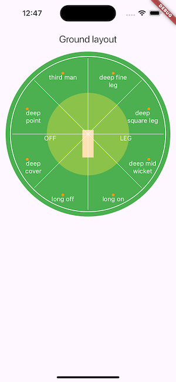
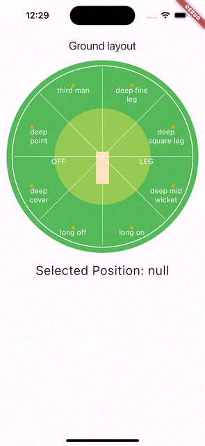

# interactive_cricket_ground_flutter

## Directory: 
- part_one: designing of ground layout and fielding position
- part_two: complete example with code from part one + detection of position + animating line till user tap

## Visual

<table>
  <tr>
    <th width="32%">part_one</th>
    <th width="32%">part_two</th>
  </tr>
  <tr>
    <td></td>
    <td></td>
  </tr>  
</table>

## Features
Explore the [Khelo cricket scoring app](https://github.com/canopas/khelo), where the interactive cricket ground feature is implemented! Check it out to see how it enhances user interaction and improves the scoring experience.